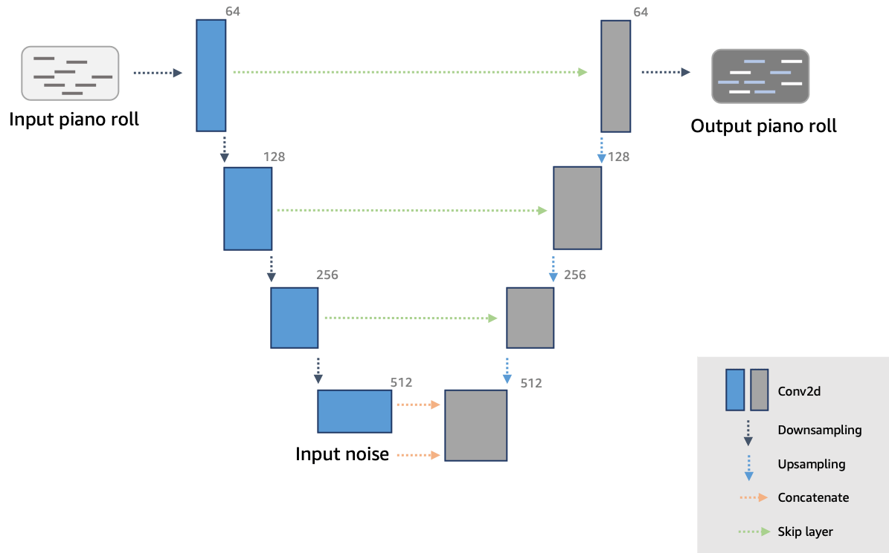
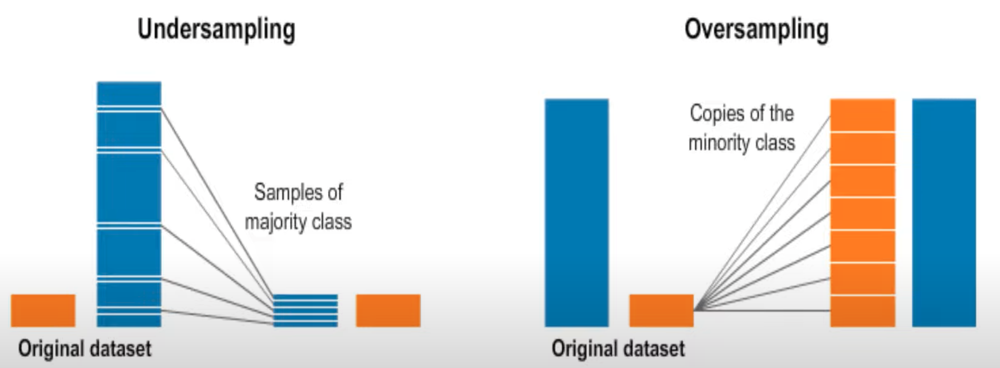

# U

## U-Net Architecture

 ~ A convolution 3x3, max pooling 2x2, and relu layers on the encoder side (CNN)

 ~ (and decoder side?). No dense or fully connected layers.

 U-Net is considered as one of the standard CNN architectures for image classification tasks. It is considered as a best network for fast and precise segmentation of images. The UNET is an architecture which was developed by Olaf Ronneberger et al. for !BioMedical Image Segmentation. It mainly consists of two paths. One is an encoder path and other is a decoder path. The encoder path captures the context of the image producing feature maps. Encoder path is just a stack of convolution and max pooling layers. Decoder path used to enable precise localisation using transposed convolutions. U-net only contains Convolutional layers and does not contain any Dense layer because of which it can accept image of any size.

 * Encoder ==> feature, i.e. pixels where the object is (spacial information). 
   * At the bottom of the encoder, the model knows the "what" is in the image
   * size of the image gets smaller and smaller, but the number of channels gets bigger and bigger
 * Decoder ==> localization (semantic information), i.e. in this area (mask) there is a bike
   * upsample the condensed information back to original size ==> no max pooling, but 2x2 transposed convolutions aka deconvolution
   * if use unpadded convolution on the encoder side, the resulting image will be smaller
   * size of the image gets bigger and bigger, the number of channels reduce
 * Encoder + Decoder = pixel perfect segmentation (awesome for segmentation)
 * Bottleneck
 * Connecting paths or SKIP CONNECTIONS ==> communicate the features to the decoding algo (copy and crop?) by concatenating the encoder output to the decoder's one

 {: width="100%"}

 

 

 

 

 

 More at:

  * paper - [https://arxiv.org/abs/1505.04597](https://arxiv.org/abs/1505.04597)

 See also [U], [Dense Layer], [Encoder-Decoder Model], [Instance Segmentation], [Semantic Segmentation], [U-Net Discriminator], [U-Net Generator]

## U-Net Discriminator

 See also [U], [U-Net Architecture]

## U-Net Generator

 The generator network used in AWS DeepComposer is adapted from the [U-Net architecture], a popular [convolutional neural network (CNN)][CNN] that is used extensively in the computer vision domain. The network consists of an “encoder” that maps the single track music data (represented as piano roll images) to a relatively lower dimensional “[latent space]“ and a ”decoder“ that maps the latent space back to multi-track music data. Here are the inputs provided to the generator:

  * Single-track piano roll: A single melody track is provided as the input to the generator.
  * Noise vector: A latent noise vector is also passed in as an input and this is responsible for ensuring that there is a flavor to each output generated by the generator, even when the same input is provided.

 {: width="100%"}

 See also [U], [Encoder-Decoder Model], [Noise Vector]

## Uncanny Valley

 When a robot is designed to look human, but is not quite there yet!

 See also [U], [Social Robot]

## Underfitting

 ~ model that is too simple (low bias) and that simplicity creates a ceiling for its potential [accuracy]. It does not even fit the training set well! --> high loss  and low accuracy

 When you have low [variance] (clustered, same accuracy for different datasets), but high bias (offset, accuracy far from 100%). To prevent underfitting try hyper-parameter optimization.

 Underfitting cases:

  * when a neural network does not have enough layers
  * when a linear regression is used to model a quadratic function/equation

 To find the sweet spot and a [balanced fitting], use:
  * [cross-validation]
  * [regularization]
  * [early stopping]
  * watch training and validation curves and make sure they don't diverge
  * ...

 {: width="100%"}

 See also [U], [Balanced Fitting], [Hyperparameter Optimization], [Overfitting]

## Undersampling

 {: width="100%"}

 See also [U], [Imbalanced Dataset], [Oversampling]

## Unfolded RNN

 A representation of a [RNN] that is easier than the [folded RNN] to understand. 
 But the [folded RNN] is the real architecture.

 See also [U], ...

## Unigram Tokenization

 The Unigram algorithm is often used in SentencePiece, which is the tokenization algorithm used by models like AlBERT, T5, mBART, Big Bird, and XLNet.

 

 More at:

  * Hugging Face course - [https://huggingface.co/learn/nlp-course/chapter6/7](https://huggingface.co/learn/nlp-course/chapter6/7)

 See also [U], ...

## Universal Function Approximator

 A [neural network] can approximate almost any function. The number of inputs need to be finite and each input should be able to be turned into numbers. Same for outputs.

 

 

 More at:

  * playground - [https://playground.tensorflow.org/](https://playground.tensorflow.org/)

 See also [U], ...

## Universal Sentence Encoder (USE)

 See also [U], ...

## Uniform Manifold Approximation and Projection (UMAP) Algorithm

 ~ an algorithm used for [Dimensionality Reduction] 

 Example applications:

  * 2D or 3D visualizing the generated [vector space] representations of movies from the movies [dataset]

 Pros:

  * Non-linear reduction that is computationally faster than [t-SNE]
  * User defined parameter for preserving local or global structure.
  * Solid theoretical foundations in manifold learning.

 Cons:

  * New, less prevalent algorithm.
  * Requires setting hyperparameters that influence quality of the embedding.
  * Non-deterministic algorithm.

 

 

 

 

 More at:

  * paper - [https://arxiv.org/abs/1802.03426](https://arxiv.org/abs/1802.03426)
  * docs - [https://umap-learn.readthedocs.io/en/latest/how_umap_works.html](https://umap-learn.readthedocs.io/en/latest/how_umap_works.html)
  * embedding projector - [https://projector.tensorflow.org/(https://projector.tensorflow.org/)
  * [https://dimensionality-reduction-293e465c2a3443e8941b016d.vercel.app/](https://dimensionality-reduction-293e465c2a3443e8941b016d.vercel.app/)
  * notebooks
    * [https://github.com/togethercomputer/together-cookbook/blob/main/Embedding_Visualization.ipynb](https://github.com/togethercomputer/together-cookbook/blob/main/Embedding_Visualization.ipynb)

 See also [U], ... 

## United States AI Safety Institute (US AISI)

 * formed inside [NIST]
 * this institute aim to establish guidles, tools,and best practices to identify and mitigate AI risk.
 * first workshop in 2023/11/20

 

 {% pdf "https://www.nist.gov/system/files/documents/noindex/2023/11/20/USAISI-workshop-slides%20%28combined%20final%29.pdf" %}

 More at:
  
  * NIST workshop on 11/17/2023 - [https://www.nist.gov/news-events/events/2023/11/usaisi-workshop-collaboration-enable-safe-and-trustworthy-ai](https://www.nist.gov/news-events/events/2023/11/usaisi-workshop-collaboration-enable-safe-and-trustworthy-ai)
  * department of commerce announcement on 11/1/2023 - [https://www.commerce.gov/news/press-releases/2023/11/direction-president-biden-department-commerce-establish-us-artificial](https://www.commerce.gov/news/press-releases/2023/11/direction-president-biden-department-commerce-establish-us-artificial)

## Unlabeled Data Algorithm

 See also [U], [Active Learning], [Data Augmentation], [Labeling Service], [Semi-Supervised Learning], [Snorkel Program], [Weak Supervision Labeling Function]

## Unlearning

 See [Machine Unlearning]

## Unstructured Data

 See also [U], [Data]

## Unstructured Pruning

 A [pruning] method that involves removing irrelevant parameters without considering the model’s structure. Essentially, unstructured pruning sets parameters below a certain threshold to zero, effectively eliminating their impact. This results in a [sparse model] where zero and non-zero weights are randomly distributed.

 Unstructured pruning is easy to implement. However, the random distribution of weights in unstructured pruning makes it difficult to leverage hardware optimization. It requires additional computation and processing steps to compress the sparse model. Moreover, the compressed model often requires further retraining to achieve optimal performance.

 Despite these challenges, there have been significant advancements in unstructured pruning , including

  * SparseGPT - a technique developed by researchers at the Institute of Science and Technology Austria (ISTA). SparseGPT performs one-shot pruning on large transformer models such as BLOOM and OPT, eliminating the need for retraining.
  * LoRAPrune - combines [low-rank adaptation (LoRA)][LoRA] with pruning to enhance the performance of [LLMs] on downstream tasks. [LoRA] is a [parameter-efficient fine-tuning (PEFT)][PEFT] technique that only updates a small subset of the parameters of a foundational model. This makes it a highly efficient method for improving model performance.

 More at:

  * [https://bdtechtalks.com/2023/09/18/what-is-llm-compression/](https://bdtechtalks.com/2023/09/18/what-is-llm-compression/)

 See also [U], [Model Compression], [Structured Pruning]

## Unsupervised Deep Learning Model

 See also [U], [Autoencoder], [Boltzmann Machine], [Self-Organizing Map], [Unsupervised Learning]

## Unsupervised Learning

 ~ trained on data without prior categorization

 `No teacher, just observations and raw data!` ==> find clusters in the samples. Leaning like a toddler would! The computer learns by itself! No labeled data? No external teacher or pre-trained data. Model detects emerging properties in the input dataset. :warning: Dataset can be modified for training (e.g masked/MLM, etc). Model then constructs patterns or clusters. Further grouped into clustering and association. The machine tries to create label on its own. Best when the relationship between the input and the output is unknown (ex: new ways to do credit card fraud?) Example: clustering.

 Algorithms:

  * [Clustering] with 
    * [Learning Vector Quantization (LVQ)]
    * [K-Means Clustering Algorithm]
    * [Self-Organizing Map (SOM)]
  * [Association Rule] with
    * [Apriori]
  * [Dimensionality Reduction]

 AI algorithm used to find patterns in X variables when there is no particular outcome variable that you want to monitor. This can be useful for tasks such as looking through large amounts of demographic and psychographic data on your customers in order to sort them into clusters or segments.

 One industry use case of this is MetLife’s automatic segmentation of their customers through unsupervised learning.

 Some possible uses for unsupervised learning:

    * Creating look-alike segments based on existing customer data.
    * Extracting previously unknown clusters of consumers based on their demographic data.

 See also [U], [Supervised Learning]

## Unsupervised Pre-Training

 In [RL], Pretrain representation using unsupervised learning before RL fine-tuning.

 See also [U], ...

## Unsupervised Sentiment Neuron

 A neural network that learns sentiment just by predicting the next character!

 We explore the properties of byte-level recurrent language models. When given sufficient amounts of capacity, training data, and compute time, the representations learned by these models include disentangled features corresponding to high-level concepts. Specifically, we find a single unit which performs sentiment analysis. These representations, learned in an unsupervised manner, achieve state of the art on the binary subset of the Stanford Sentiment Treebank. They are also very data efficient. When using only a handful of labeled examples, our approach matches the performance of strong baselines trained on full datasets. We also demonstrate the sentiment unit has a direct influence on the generative process of the model. Simply fixing its value to be positive or negative generates samples with the corresponding positive or negative sentiment.

 

 

 

 More at:

  * blog - [https://openai.com/research/unsupervised-sentiment-neuron](https://openai.com/research/unsupervised-sentiment-neuron)
  * paper - [https://arxiv.org/abs/1704.01444](https://arxiv.org/abs/1704.01444)
  * code - [https://github.com/openai/generating-reviews-discovering-sentiment](https://github.com/openai/generating-reviews-discovering-sentiment)
  * articles
    * [https://www.wired.com/story/what-openai-really-wants/](https://www.wired.com/story/what-openai-really-wants/)

 See also [U], ...

## Update Ratio

 A ratio of the number of times the discriminator is updated per generator training epoch. Updating the discriminator multiple times per generator training epoch is useful because it can improve the discriminators accuracy. Changing this ratio might allow the generator to learn more quickly early-on, but will increase the overall training time.

 See also [U], [Discriminator]

## Upstream Task

 The task executed in a pre-trained model.

 See also [U], [Pre-Trained Model], [Self-Supervised Learning]

## User Prompt

 See also [U], [System Prompt]

## Utility

 Utilities

  * [NotebookLM] - developed by google for research
